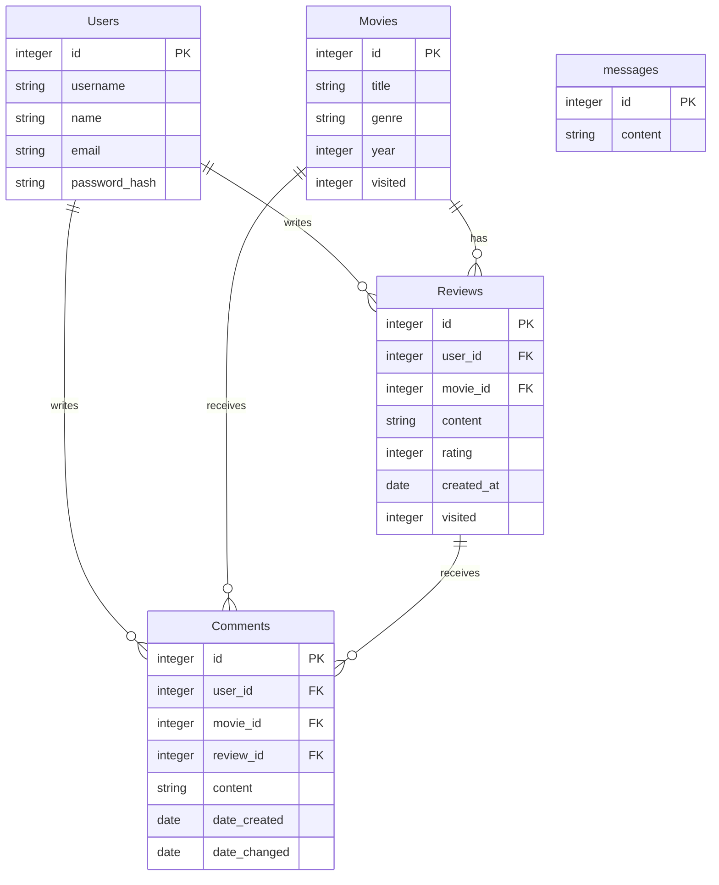

# movie-app

Aja ensin `sqlite3 database.db < schema.sql` alustaaksesi tietokanta. Sen jälkeen `source venv/bin/activate` ja `flask run`.

## Välipalautus 3

Valmiina hahmotelma käyttäjästatistiikasta, mutta vielä ei toimi ihan oikein eikä haeta käyttäjälle tietoja vaan yleisesti.

- [x] Käyttäjä pystyy luomaan tunnuksen ja kirjautumaan sisään sovellukseen.
- Käyttäjä pystyy: 
    - [x] lisäämään, 
    - [ ] muokkaamaan ja 
    - [ ] poistamaan tietokohteita.
- [x] Käyttäjä näkee sovellukseen lisätyt tietokohteet.
- [ ] Käyttäjä pystyy etsimään tietokohteita hakusanalla tai muulla perusteella.

- [x] Sovelluksessa on käyttäjäsivut, 
    - [x] jotka näyttävät tilastoja ja 
    - [ ] käyttäjän lisäämät tietokohteet.
- [x] Käyttäjä pystyy valitsemaan tietokohteelle yhden tai useamman luokittelun. Mahdolliset luokat ovat tietokannassa.
- [ ] Käyttäjä pystyy lähettämään toisen käyttäjän tietokohteeseen liittyen jotain lisätietoa, joka tulee näkyviin sovelluksessa.

## Välipalautus 2

Tällä hetkellä sovellus ei toimi kunnolla, mutta funktiot taulujen käsittelyyn ja osa toiminnoista toimivat.

Kun ajaa flaskin, sovellus alustaa tällä hetkellä tietokannan taulut joka kerta. Jos sen haluaa pois, (eli että taulut säilyvät sessioiden yli) voi ensimmäisen kerran jälkeen kommentoida `app.py` rivin `create_tables()`. 

## Välipalautus 1

Tietokannat- ja web-ohjelmoiti -kurssin harjoitustyö.

Tässä harjoitustyössä tarkoitus on tehdä web-sovellus, jossa käyttäjä voi lisätä elokuva-arvosteluja (ensisijainen tietokohde). Arvostelut koostuvat tähdistä (1-5) ja tekstistä. Sovelluksessa pystyy myös katselemaan muiden käyttäjien antamia arvosteluja, sekä mahdollisesti kommentoimaan niitä (toissijainen tietokohde). Käyttäjä pystyy myös muokkaamaan antamiaan arvostelua. Arvostelun antaessa voi asettaa elokuvalle genrejä sekä lisätä elokuvalle kuvan, jos sille ei vielä löydy kuvaa (joku toinen käyttäjä ei ole jo lisännyt).  

Hakutoiminnolla käyttäjä pystyy etsimään elokuvia nimen, genren ja julkaisuvuoden mukaan. 

Käyttäjäsivulla näkee kaikki käyttäjät, näiden arvostelut sekä statistiikka.

Tietokannassa on neljä taulua:

- Reviews
    - ensisijainen tietokohde
- Movies
    - toissijainen tietokohde
- Users
    - käyttäjien hallinnointiin
- Comments
    - toissijainen tietokohde

Alla kuvaus tietokantataulujen suunnitelmasta.

source venv/bin/activate

flask run
deactivate