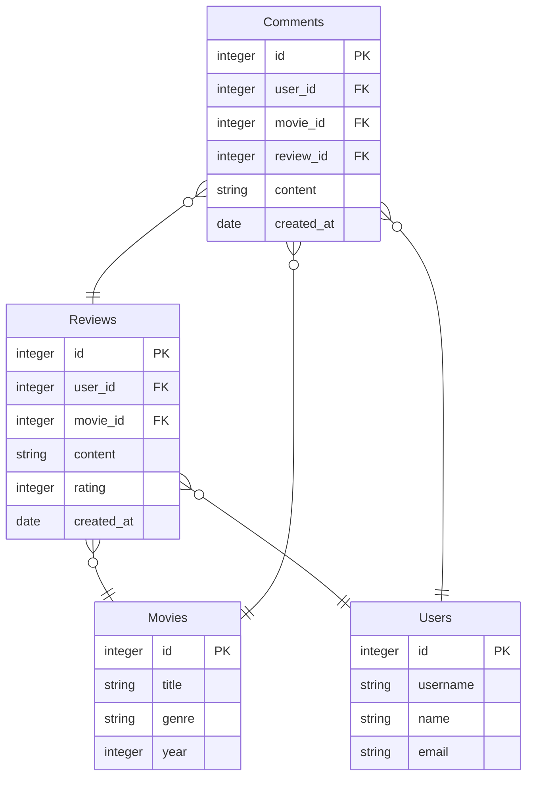

# movie-app

Tietokannat- ja web-ohjelmoiti -kurssin harjoitustyö.

Tässä harjoitustyössä tarkoitus on tehdä web-sovellus, jossa käyttäjä voi lisätä elokuva-arvosteluja (ensisijainen tietokohde). Arvostelut koostuvat tähdistä (1-5) ja tekstistä. Sovelluksessa pystyy myös katselemaan muiden käyttäjien antamia arvosteluja, sekä mahdollisesti kommentoimaan niitä (toissijainen tietokohde). Käyttäjä pystyy myös muokkaamaan antamiaan arvostelua. Arvostelun antaessa voi asettaa elokuvalle genrejä sekä lisätä elokuvalle kuvan, jos sille ei vielä löydy kuvaa (joku toinen käyttäjä ei ole jo lisännyt).  

Hakutoiminnolla käyttäjä pystyy etsimään elokuvia nimen, genren ja julkaisuvuoden mukaan. 

Käyttäjäsivulla näkee kaikki käyttäjät, näiden arvostelut sekä statistiikka.

Tietokannassa on neljä taulua:

- Reviews
    - ensisijainen tietokohde
- Movies
    - toissijainen tietokohde
- Users
    - käyttäjien hallinnointiin
- Comments
    - toissijainen tietokohde

Alla kuvaus tietokantataulujen suunnitelmasta.

source venv/bin/activate

flask run
deactivate