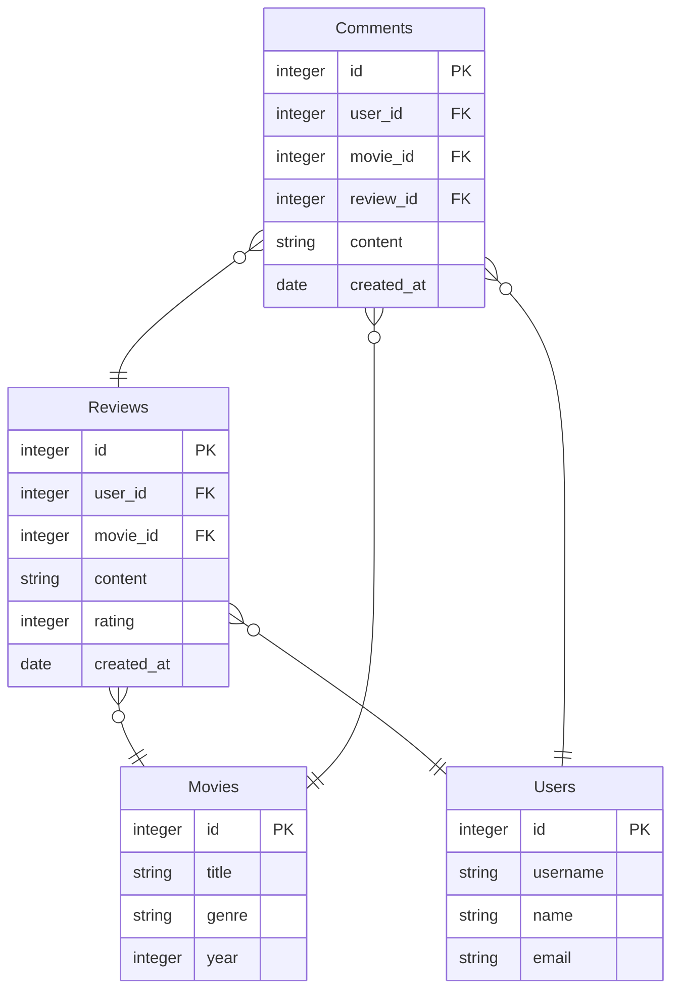

# movie-app

Tietokannat- ja web-ohjelmoiti -kurssin harjoitustyö.

Tässä harjoitustyössä tarkoitus on tehdä web-sovellus, jossa käyttäjä voi lisätä elokuva-arvosteluja (ensisijainen tietokohde). Arvostelut koostuvat tähdistä (1-5) ja tekstistä. Sovelluksessa pystyy myös katselemaan muiden käyttäjien antamia arvosteluja, sekä mahdollisesti kommentoimaan niitä (toissijainen tietokohde). Käyttäjä pystyy myös muokkaamaan antamiaan arvostelua. Arvostelun antaessa voi asettaa elokuvalle genrejä sekä lisätä elokuvalle kuvan, jos sille ei vielä löydy kuvaa (joku toinen käyttäjä ei ole jo lisännyt).  

Hakutoiminnolla käyttäjä pystyy etsimään elokuvia nimen, genren ja julkaisuvuoden mukaan. 

Käyttäjäsivulla näkee kaikki käyttäjät, näiden arvostelut sekä statistiikka.

Tietokannassa on neljä taulua:
- Movies
- Users
- Comments
- Reviews

- Käyttäjä pystyy luomaan tunnuksen ja kirjautumaan sisään sovellukseen.
- Käyttäjä pystyy lisäämään sovellukseen tietokohteita. Lisäksi käyttäjä pystyy muokkaamaan ja poistamaan lisäämiään tietokohteita.
- Käyttäjä näkee sovellukseen lisätyt tietokohteet. Käyttäjä näkee sekä itse lisäämänsä että muiden käyttäjien lisäämät tietokohteet.
- Käyttäjä pystyy etsimään tietokohteita hakusanalla tai muulla perusteella. Käyttäjä pystyy hakemaan sekä itse lisäämiään että muiden käyttäjien lisäämiä tietokohteita.
- Sovelluksessa on käyttäjäsivut, jotka näyttävät jokaisesta käyttäjästä tilastoja ja käyttäjän lisäämät tietokohteet.
- Käyttäjä pystyy valitsemaan tietokohteelle yhden tai useamman luokittelun. Mahdolliset luokat ovat tietokannassa.
- Sovelluksessa on pääasiallisen tietokohteen lisäksi toissijainen tietokohde, joka täydentää pääasiallista tietokohdetta. Käyttäjä pystyy lisäämään toissijaisia tietokohteita omiin ja muiden käyttäjien tietokohteisiin liittyen.

